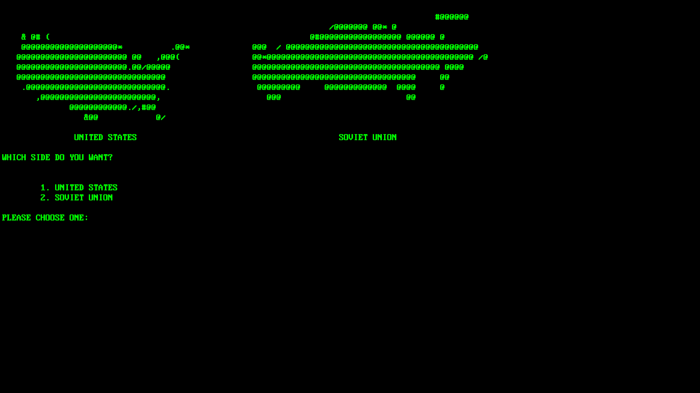

# WOPR Console

WOPR Console is a spoof of Joshua (the computer) from WarGames. It is programed in C#.
[//]: # ()

The app isn't compiled; I will compile in the first release but for now you will have to have Visual Studio and .NET Core installed.
